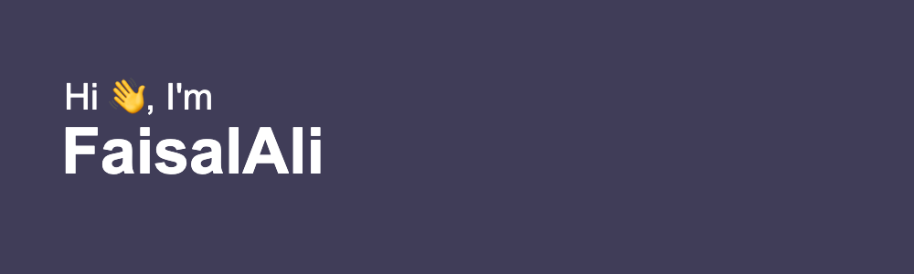

<!-- **FaisalAli19/FaisalAli19** is a ✨ _special_ ✨ repository because its `README.md` (this file) appears on your GitHub profile. -->

  

<h1 align="center">FaisalAli Sayyed</h1>

  

  <b> <i> "Forging high-performance digital architectures and safeguarding the decentralized frontier." </i> </b>

  
  
  
  

---

## 🛡️ Security Research & Auditing

As a security researcher and bug bounty hunter, I specialize in identifying critical vulnerabilities in decentralized protocols and smart contracts.

| Platform     | Profile                                                                              | Focus Areas                                       |
| :----------- | :----------------------------------------------------------------------------------- | :------------------------------------------------ |
| **Immunefi** | <a href="https://immunefi.com/profile/faisalali19/" target="_blank">View Profile</a> | Smart Contract Auditing, Logic Errors, Reentrancy |
| **Bugcrowd** | <a href="https://bugcrowd.com/h/FaisalAli" target="_blank">View Profile</a>          | Web2/Web3 Pentesting, Protocol Security           |

**Tools:** `Slither` `Echidna` `Foundry` `Hardhat` `Mythril`

---

## 🚀 Featured Projects

<table>
  <tr>
    <td width="50%">
      <h3 align="center">DustFund</h3>
      
A comprehensive DeFi platform on the BNB Chain featuring a robust staking ecosystem and a secure presale mechanism.

      

        
        
        
      

      

        <a href="https://www.faisalali.dev/portfolio/1" target="_blank"><b>View Case Study ➜</b></a>
      

    </td>
    <td width="50%">
      <h3 align="center">HNS Marketplace</h3>
      
A specialized NFT marketplace on Optimism for trading HNS domains, featuring advanced GraphQL indexing.

      

        
        
        
      

      

        <a href="https://www.faisalali.dev/portfolio/2" target="_blank"><b>View Case Study ➜</b></a>
      

    </td>
  </tr>
  <tr>
    <td colspan="2">
      <h3 align="center">Portraits de Famille</h3>
      
Sophisticated NFT-based lottery dApp embedded in Shopify for a hybrid Web2/Web3 commerce experience.

      

        
        
        
      

      

        <a href="https://www.faisalali.dev/portfolio/4" target="_blank"><b>View Case Study ➜</b></a>
      

    </td>
  </tr>
</table>

---

## 💻 Tech Stack

### Languages & Frameworks

       

### Infrastructure & Tools

    

---

## 📊 GitHub Stats

  
  

 

  

---

  <b>Always learning, always building. Let’s connect and grow together!</b> 
  

